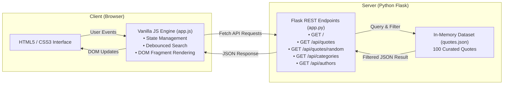

# QuoteWise — 100 Famous Quotes Web Application

[](https://www.python.org/)
[](https://flask.palletsprojects.com/)
[](https://docs.pytest.org/)
[](https://developer.mozilla.org/)
[](LICENSE)

An interactive, responsive single-page web application built with **Python Flask**, **plain vanilla JavaScript**, **HTML5**, and modern **CSS3** to explore, search, and discover 100 curated, iconic quotes from history's greatest thinkers, writers, scientists, and leaders.

---

## Table of Contents
- [Features](#features)
- [Architecture](#architecture)
- [Project Structure](#project-structure)
- [API Reference](#api-reference)
- [Getting Started](#getting-started)
  - [Prerequisites](#prerequisites)
  - [Installation](#installation)
  - [Running the Application](#running-the-application)
- [Running Automated Tests](#running-automated-tests)
- [Curated Dataset](#curated-dataset)
- [License](#license)

---

## Features

- **Featured Random Quote**: Displays an inspiring quote on arrival. The "New Random Quote" button cycles through quotes smoothly without repeating the current one.
- **Instant Live Search**: Debounced real-time search (250ms) matching quote text and author names simultaneously.
- **Faceted Category Filtering**: Interactive category pills (*Inspiration*, *Philosophy*, *Science*, *Wisdom*, *Humor*, *Literature*, *Leadership*, *Life*) with live quote count badges.
- **Author Filtering**: Dropdown selection and clickable author tags on every quote card to isolate quotes by individual thinkers.
- **One-Click Copy**: Copies formatted quotes (`"Quote" — Author`) directly to your clipboard with animated toast notification feedback.
- **Zero Frontend Frameworks**: 100% pure vanilla JavaScript (ES6+), semantic HTML5, and CSS variables for dark-mode theming and responsive card grids.
- **RESTful Flask Backend**: Fast, in-memory filtering delivering sub-5ms API responses.
- **Comprehensive Pytest Suite**: 11 unit tests covering endpoint schemas, dataset integrity, and search/filter permutations.

---

## Architecture



---

## Project Structure

```
quote-app/
├── app.py                  # Flask backend & REST API endpoints
├── requirements.txt        # Backend dependencies (Flask, Pytest)
├── README.md               # Project documentation
├── .gitignore              # Ignored files (Python caches, virtual envs, OS files)
├── data/
│   └── quotes.json         # Curated 100-quote dataset
├── static/
│   ├── css/
│   │   └── style.css       # Responsive dark-mode styles, card grid & animations
│   └── js/
│       └── app.js          # Client-side state, event listeners & Fetch API calls
├── templates/
│   └── index.html          # Semantic HTML5 single-page layout
└── tests/
    └── test_app.py         # Automated unit test suite
```

---

## API Reference

### 1. `GET /api/quotes`
Retrieve quotes matching optional search and filter criteria.

**Query Parameters:**
| Parameter | Type | Description |
| :--- | :--- | :--- |
| `search` / `q` | `string` | Case-insensitive substring search in quote body or author name. |
| `category` | `string` | Filter by category (e.g. `Science`, `Philosophy`). Defaults to all. |
| `author` | `string` | Filter by author name (case-insensitive substring). |

**Sample Response (`GET /api/quotes?category=Science`):**
```json
{
  "total": 9,
  "quotes": [
    {
      "id": 5,
      "quote": "I have not failed. I've just found 10,000 ways that won't work.",
      "author": "Thomas Edison",
      "category": "Science"
    },
    {
      "id": 16,
      "quote": "Imagination is more important than knowledge.",
      "author": "Albert Einstein",
      "category": "Science"
    }
  ]
}
```

---

### 2. `GET /api/quotes/random`
Fetch a single random quote.

**Query Parameters:**
| Parameter | Type | Description |
| :--- | :--- | :--- |
| `exclude_id` | `integer` | ID of the current quote to prevent immediate duplicates. |
| `category` | `string` | Restrict random selection to a specific category. |
| `author` | `string` | Restrict random selection to a specific author. |

**Sample Response:**
```json
{
  "quote": {
    "id": 4,
    "quote": "In the middle of difficulty lies opportunity.",
    "author": "Albert Einstein",
    "category": "Inspiration"
  }
}
```

---

### 3. `GET /api/categories`
Returns all unique categories with their respective quote counts.

**Sample Response:**
```json
{
  "categories": [
    { "count": 5, "name": "Humor" },
    { "count": 21, "name": "Inspiration" },
    { "count": 13, "name": "Leadership" },
    { "count": 12, "name": "Life" },
    { "count": 10, "name": "Literature" },
    { "count": 14, "name": "Philosophy" },
    { "count": 9, "name": "Science" },
    { "count": 16, "name": "Wisdom" }
  ],
  "total_quotes": 100
}
```

---

### 4. `GET /api/authors`
Returns all unique authors with total quotes attributed to each.

---

## Getting Started

### Prerequisites
- **Python 3.10+**
- **pip** package manager

### Installation

1. **Clone the repository:**
   ```bash
   git clone https://github.com/audleyhar/audleyhar-famous-quotes.git
   cd audleyhar-famous-quotes
   ```

2. **Create and activate a virtual environment (optional but recommended):**
   ```powershell
   # Windows
   python -m venv venv
   .\venv\Scripts\activate

   # macOS / Linux
   python3 -m venv venv
   source venv/bin/activate
   ```

3. **Install dependencies:**
   ```bash
   pip install -r requirements.txt
   ```

### Running the Application

```bash
python app.py
```

Open your browser and navigate to:
```
http://127.0.0.1:5000
```

---

## Running Automated Tests

The test suite validates data structure integrity, HTTP status codes, and search/filter permutations:

```bash
pytest tests/ -v
```

**Expected output:**
```
tests/test_app.py::test_dataset_integrity PASSED                         [  9%]
tests/test_app.py::test_index_page PASSED                                [ 18%]
tests/test_app.py::test_get_all_quotes PASSED                            [ 27%]
tests/test_app.py::test_get_random_quote PASSED                          [ 36%]
tests/test_app.py::test_get_random_quote_filtered_by_category PASSED     [ 45%]
tests/test_app.py::test_get_random_quote_filtered_by_author PASSED       [ 54%]
tests/test_app.py::test_search_quotes_by_author PASSED                   [ 63%]
tests/test_app.py::test_filter_quotes_by_category PASSED                 [ 72%]
tests/test_app.py::test_search_quotes_by_keyword PASSED                  [ 81%]
tests/test_app.py::test_get_categories PASSED                            [ 90%]
tests/test_app.py::test_get_authors PASSED                               [100%]

============================= 11 passed in 0.19s ==============================
```

---

## Curated Dataset

The quotes dataset ([`data/quotes.json`](data/quotes.json)) contains 100 well-known quotes curated across 8 themes:
- **Inspiration** (Steve Jobs, Eleanor Roosevelt, Theodore Roosevelt)
- **Philosophy** (Socrates, Aristotle, Marcus Aurelius, René Descartes)
- **Science** (Albert Einstein, Marie Curie, Stephen Hawking, Carl Sagan)
- **Wisdom** (Confucius, Lao Tzu, Buddha, Ralph Waldo Emerson)
- **Humor** (Mark Twain, Oscar Wilde, George Bernard Shaw)
- **Literature** (William Shakespeare, Maya Angelou, Ernest Hemingway)
- **Leadership** (Nelson Mandela, Winston Churchill, Abraham Lincoln)
- **Life** (John Lennon, Robert Frost, Dalai Lama)

---

## License

This project is licensed under the [MIT License](LICENSE).
